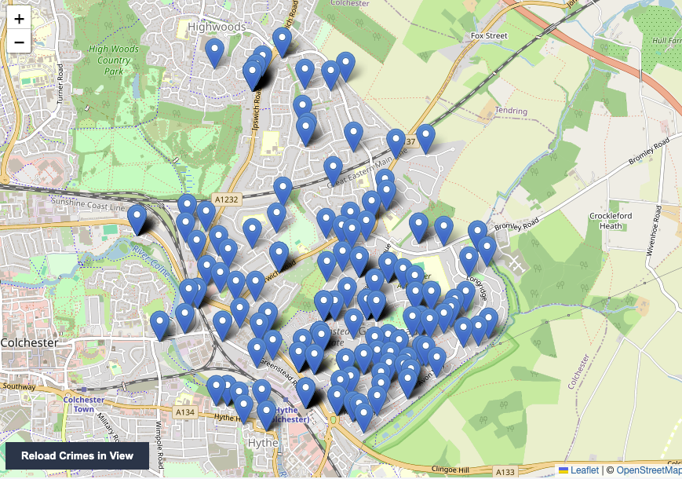
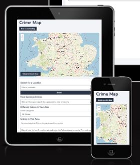
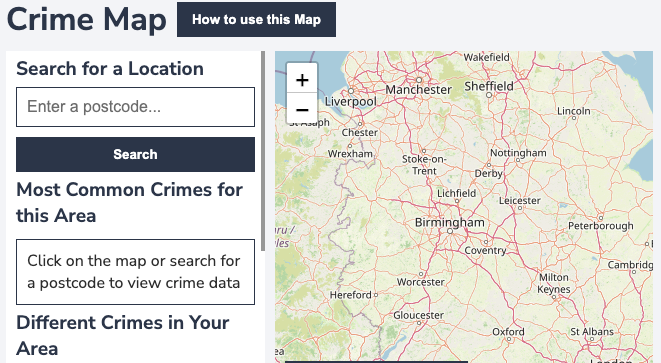

# Crime Map of England and Wales

## Table of Contents

### 1. User Experience
#### a. Purpose of the Website
#### b. User Stories
#### c. Wireframes
#### d. Colour Palette
#### e. Fonts
#### f. Features
#### g. User Interface Design Decisions

### 2. Technologies Used
#### a. APIs Used
#### b. Map Information
#### c. Other Code Credits

### 3. Deployment Information
#### a. Version Control
#### b. Deployment to Github Pages
#### c. Clone the Code Locally

### 4. Testing (See seperate Testing.md file)

### 5. Improvements for Future Releases

### 6. Credits

### 1. User Experience

#### Purpose of the Website

This website is built to allow people to see how much crime has happened in an area in the last 3 months and understand what type of crime it is. The website is able to search across England and Wales using official UK Police data. It is as up to date as the latest data revealed by the Police (which is usually approximately a month old). The date that the data was most recently updated is shown on the website.

#### User Stories

##### Story A

Someone is looking to buy/rent a house in a local area and wants to understand how much crime is committed to get a feel for how safe the area is.
    - They need an easily searchable and viewable map and the ability to look at each crime incident in more detail.

#### Story B

Someone wants to understand the types of crimes committed in their area to get a more in depth feel of the local social issues.
    - They need a filter that easily allows you to see the type and location of each crime. 
    - They also want to understand which crimes are most common in the local area.

#### Story C

A tourist is visiting a town and they want to understand the safest area of town to stay in.
    - They need a map that can be moved around within an area and the map regenerates to show the crimes within the new area.

#### Story D

A car owner wants to know if it is safe to park their car in an area.
    - They need to be able to filter vehicle crime and see how common it is in an area.

### Wireframes

Wireframes were built using [Balsamiq](https://balsamiq.com/)

Wireframe for the desktop version -

The design is as simple and visually easy as possible. There is a sidebar that contains the postcode search, a list of crimes in the area and a summary of the top 3 crimes. 

### Colour Scheme

I have used a colour scheme that was designed to provide contrast, while still looking smart and professional

*This image was generated by [Claude AI](https://claude.ai/)

### Fonts

Nunito sans from [Google Fonts](https://fonts.google.com/) is used to give a clean look that is easy to read.

### Features

The website has several features which allow the user to search crimes nationally and look at different statistics.

#### How to use Modal

There is a pop up modal which gives instructions on how to use the map and the features.

#### Map

The website uses Leaflet maps to generate a map with markers in the locations where crimes have occured. You can scroll on this map and select an area you would like to see the crime information for.

#### Postcode Search

You can search using a UK postcode to find an area you want. Once a postcode is entered the map automatically scrolls to that area.

#### There is a box showing the top 3 crimes in your selected area and the percentage of those crimes.

This is showing a summary of the most common crimes in the selected area. These update dynamically as you search a new area.

#### Dropdown to filter crime types

There is a dropdown menu that allows you to filter the crime types to only the ones you are interested in searching within a selected area. The contents of this menu update dynamically to include crimes that have been committed in the selected area.

#### There is a list of crimes in the area, the crime is highlighted when it's corresponding marker on the map is selected

There is a scrollable list of crimes that appears dynamically when you select a postcode/area on the map. A crime is highlighted when you select the corresponding marker on the map. You can also select a crime, which will open up the pop up for the corresponding marker on the map.

#### There are markers on the map, which when clicked on have pop-ups with information

These markers will also highlight the corresponding crime on the list.

#### There is a date that shows when the the information was last updated.

This date is fetched directly from the Police API to explain when it was last updated, so people can understand how up to date the information they are looking at is.

#### There is a 'Reload Crimes in View' Button that allows you to reload after scrolling the map

The button allows you to reload the data for your current view after scrolling the map.

### User Interface Design Decisions

The main part of the screen is dominated by the map, but there is a sidebar along the left to make navigation and features easier to find.

The postcode search is at the top of the sidebar as this is likely to be used regularly and should be easy to find.

For mobiles and tablets in portrait mode the title is shortened to 'Crime Map' so it fits on one line. The sidebar is also stacked under the map to give the map more screen space and make it easier to use.

While using mobiles and tablets in landscape mode the sidebar goes back to the side. This make the functions easier to use with the map.

### 2. Technologies Used
The website is built using HTML, CSS and javascript.

#### APIs Used

The website uses 2 APIs.

It uses the official UK Police API for street level crimes. The documentation can be found here -

[https://data.police.uk/docs/method/crime-street/](https://data.police.uk/docs/method/crime-street/)

It also uses a postode API to calculate to longitude and latitude for each postcode to position the map correctly. The documentation can be found here -

[https://postcodes.io/](https://postcodes.io/)

#### Map Information

The map and the markers are generated using Leaflet Maps, a javascript library for interactive maps. The documentation can be found here -

[https://leafletjs.com/](https://leafletjs.com/)

#### Other Code Credits

Some code is used for formatting dates that was found on stackoverflow.

The exact post I used is here - 

[https://stackoverflow.com/questions/6040515/how-do-i-get-month-and-date-of-javascript-in-2-digit-format](https://stackoverflow.com/questions/6040515/how-do-i-get-month-and-date-of-javascript-in-2-digit-format)

### 3. Deployment Information
#### a. Version Control

The site was created using the Visual Studio code editor and pushed to github to the remote repository ‘crime_map’.

The following git commands were used throughout development to push code to the remote repo:

git add <file> - This command was used to add the file(s) to the staging area before they are committed.

git commit -m “commit message” - This command was used to commit changes to the local repository queue ready for the final step.

git push - This command was used to push all committed code to the remote repository on github.

#### b. Deployment to Github Pages

The site was deployed to GitHub pages. The steps to deploy are as follows:
- In the GitHub repository, navigate to the Settings tab
- From the menu on left select 'Pages'
- From the source section drop-down menu, select the Branch: main
- Click 'Save'
- A live link will be displayed in a green banner when published successfully.

The live link can be found here - [https://christinalicence.github.io/crime_map/](https://christinalicence.github.io/crime_map/)

#### c. Clone the Code Locally

Navigate to the GitHub Repository you want to clone to use locally:

- Click on the code drop down button
- Click on HTTPS
- Copy the repository link to the clipboard
- Open your IDE of choice (git must be installed for the next steps)
- Type git clone copied-git-url into the IDE terminal
- The project will now have been cloned on your local machine for use.

### 4. Testing (See seperate Testing.md file)

The manual and automated testing is documented in the [Testing.md](Testing.md) file.

### 5. Improvements for Future Releases.

There are still various improvments that could be made to the map.

- Improve the map bounds with completeley accurate longitude and latitude for the country. At the moment they are approximate. You could also blur out areas not within England and Wales, or make them grey.

- Make the marker for a selected crime highlighted to improve the visual affect.

- Include more information on the pop-up for each crime, including the exact date of the crime and the status of whether it is solved/concluded.

- Improve the map so you can see exactly what area is being searched in a postcode or a click.

- Include a search feature to allow you to search the road names of the crimes in the sidebar.

### 6. Credits

[Google Fonts](https://fonts.google.com/) was used for the fonts.

[Balsamiq](https://balsamiq.com/) was used for the wireframes.

[VS Code](https://code.visualstudio.com/) was used as an IDE.

[github](https://github.com/) was used for storage and depolyment.

[https://postcodes.io/](https://postcodes.io/) was used an API.

[https://leafletjs.com/](https://leafletjs.com/) was used for the map.

[https://data.police.uk/](https://data.police.uk/) was used as an API.

[https://stackoverflow.com](https://stackoverflow.com) was used to help with code, particularly dates in javascript.

[Claude AI](https://claude.ai/) was used to generate the colour palette image.
