# Manual Tesing

## Are the User Stories Accomplished?

## JS Hint

I used [JSHint](https://jshint.com/) to check my javascript file.

It gave me a warning for using async functions as they are a more up to date function than is compatible with JSHint

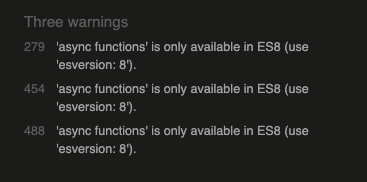

The async functions used while fetching data from the API are important for functionality, so I didn't adjust the code based on this warning.

It also listed an undefined variable. 

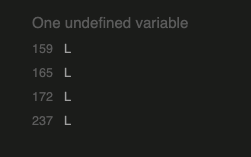

This is a result of the code used by Leaflet Maps which I used to generate the map. I didn't adjust code based on this as it is important for the running of the website.

## HTML validator

I used the [W3C HTML validator](https://validator.w3.org/)

It had no warnings, but there were same "trailing slash on void elements' pointed out 

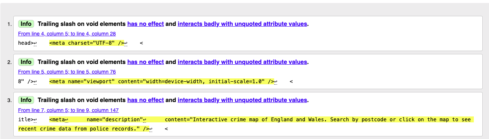

## CSS Validator

I used the [W3C CSS validator](https://jigsaw.w3.org/css-validator/)

It passed with no errors
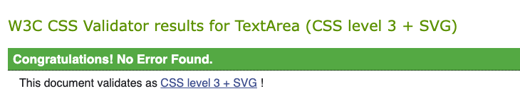

There was one warning because external imports are not checked, this appeared because I used Google fonts.

## Wave Testing

I used the [WAVE accessibility evaluation tool](https://wave.webaim.org/) to test for any accessibility issues. 

The report showed one error

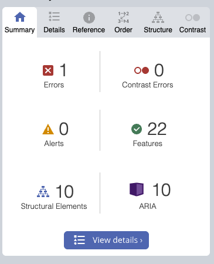

This was a missing aria label for my postcode search.

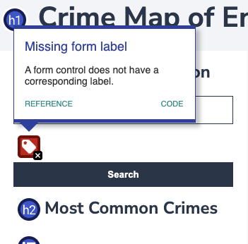

I have corrected this issue by adding an Aria label.

## Lighthouse testing

The Lighthouse testing has created some interesting issues.

### Performance

The Performance Score is 86

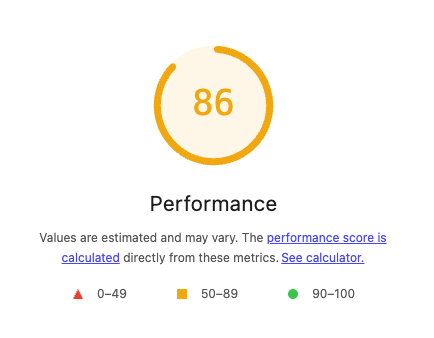

The metrics are

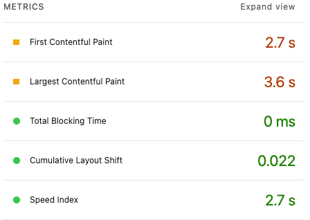

I think these are acceptible.

### Accessibility

The accessibility report has created consistent issues. It has repeatedly crashed, doesn't give a score and doesn't flag any elements that need attention.

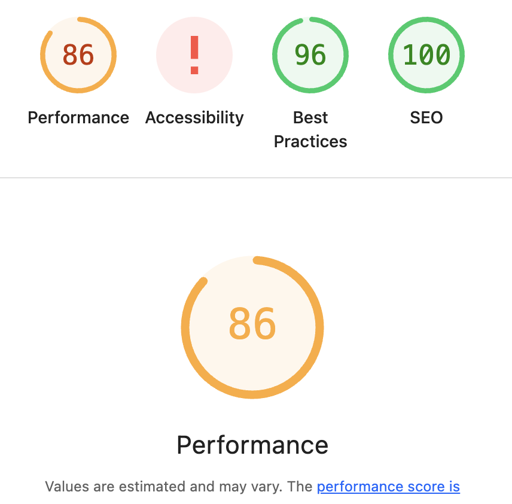

There are no details to fix given in the report

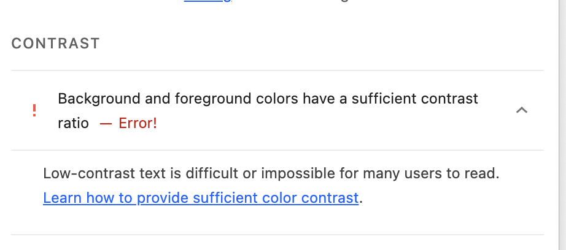

### Best Practice

The Best Practice is 100% when run on a desktop

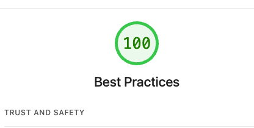

But only 96% when run on a mobile 

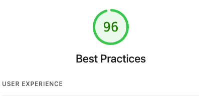

It flags that some of the map images are low resolution in this format

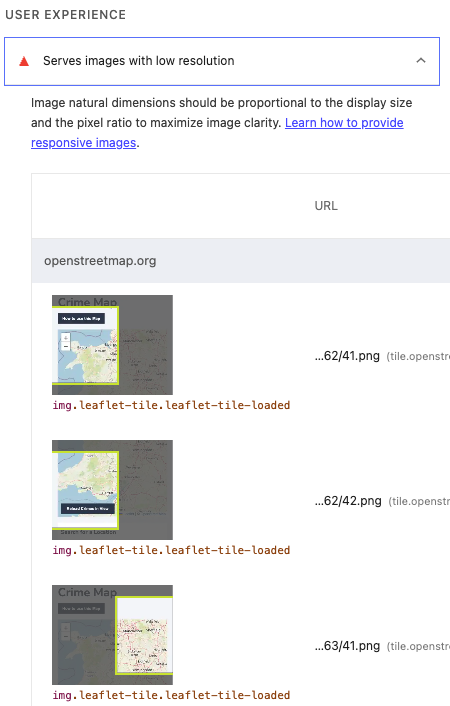

As these are imported using the Leflet maps and open streep maps I haven't adjusted these images.

### SEO

The Lighthouse SEO report is 100%

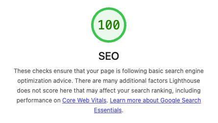

# Automated Testing

## Automated Testing with Jest