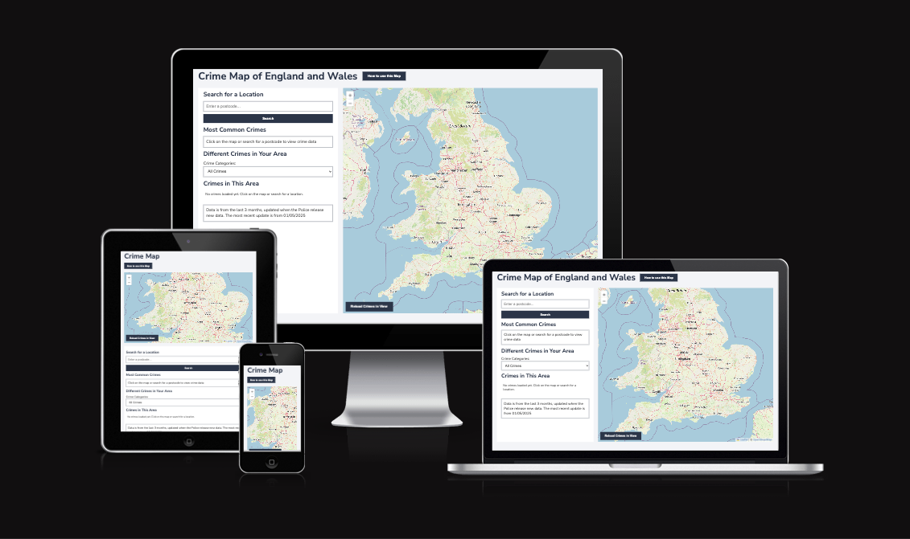
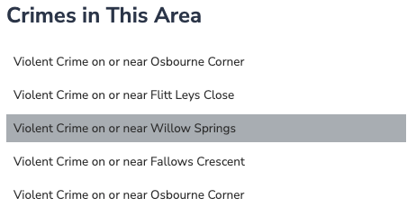
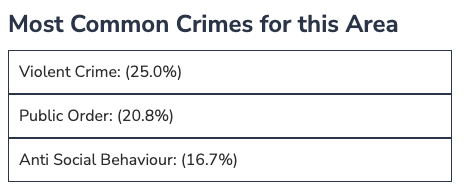
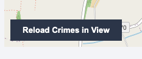

# Testing for the Crime Map of UK and Wales

## Table of Contents

### 1. Manual Testing
#### a. Are the User Stories Accomplished
#### b. Testing Using Code Validators
#### c. Accessibility and Performance Testing
#### d. Manual Testing of Features
#### e. Manual Testing of Responsiveness
#### f. User Testing/Feedback

### 2. Automated Testing using Jest

## Manual Testing

### Are the User Stories Accomplished?

#### Story A

Someone is looking to buy/rent a house in a local area and wants to understand how much crime is committed to get a feel for how safe the area is.
    - They need an easily searchable and viewable map and the ability to look at each crime incident in more detail.

##### Accomplished through the map feature

#### Story B

Someone wants to understand the types of crimes committed in their area to get a more in depth feel of the local social issues.
    - They need a filter that easily allows you to see the type and location of each crime. 
    - They also want to understand what crimes are most common in the local area.

##### Accomplished through the dropdown crime type filter and the list of top 3 local crimes

The dropdown lets you search crimes locally by type.

The list of top 3 crimes in the local area gives detail about what is most common and how common they are.

#### Story C

A tourist is visiting a town and they want to understand the safest area of town to stay in.
    - They need a map that can be moved around within an area and the map regenerates to show the crimes within the new area.

##### Accomplished using the map feature and reload button

You can scroll on the map and press the reload button

#### Story D

A car owner wants to know if it is safe to park their car in an area.
    - They need to be able to filter vehicle crime and see how common it is in an area.

##### Accomplished using the dropdown filter.

You can filter vehicle crime using the dropdown and see all vehicle crime on the map.

### Testing Using Code Validators

#### JS Hint

I used [JSHint](https://jshint.com/) to check my javascript file.

It gave me a warning for using async functions as they are a more up to date function than is compatible with JSHint

The async functions used while fetching data from the API are important for functionality, so I didn't adjust the code based on this warning.

It also listed an undefined variable. 

This is a result of the code used by Leaflet Maps which I used to generate the map. I didn't adjust code based on this as it is important for the running of the website.

#### HTML validator

I used the [W3C HTML validator](https://validator.w3.org/)

It had no warnings, but there were same "trailing slash on void elements' pointed out 

#### CSS Validator

I used the [W3C CSS validator](https://jigsaw.w3.org/css-validator/)

It passed with no errors

There was one warning because external imports are not checked, this appeared because I used Google fonts.

### Accessibility and Performance Testing

### Wave Testing

I used the [WAVE accessibility evaluation tool](https://wave.webaim.org/) to test for any accessibility issues. 

The report showed one error

This was a missing aria label for my postcode search.

I have corrected this issue by adding an Aria label.

#### Lighthouse testing

The Lighthouse testing has created some interesting issues.

##### Performance

The Performance Score is 86

The metrics are

I think these are acceptable.

##### Accessibility

The accessibility report has created consistent issues. It has repeatedly crashed, doesn't give a score and doesn't flag any elements that need attention.

There are no details to fix given in the report

This seems to be a known bug within Leaflet/Lighthouse

[Link to github post](https://github.com/GoogleChrome/lighthouse/issues/15497)

##### Best Practice

The Best Practice is 100% when run on a desktop

But only 96% when run on a mobile 

It flags that some of the map images are low resolution in this format

As these are imported using the Leflet maps and open streep maps I haven't adjusted these images.

##### SEO

The Lighthouse SEO report is 100%

### Manual Testing of Features

The different features of the website have been tested extensively. They have been tested to ensure they work and to give appropriate error messages if there is an issue.

### Manual Testing of Responsiveness

It has been tested on all common screen types, including iphone and android phones, both on landscape and portrait mode.

### User Testing/Feedback

User testing was carried out, a useful piece of feedback was to ensure it could be fully used with just the keyboard. The tab button wasn't working properly to move between the different crimes in the dropdown list. I solved this by adding tabindex="0" to the code.

## Automated Testing using Jest

I chose to write some automated tests for my javascript.

The functions I wrote tests for were 

### lastMonthDate

This is an important function that formats the date correctly for the fetch call to the Police API. I tested it because it is an important one for the API to function.

### highlightListedItem

This function highlights a crime list item when it is clicked on, or the corresponding marker is clicked on. I wanted to test it because it is a visual function that relies on a few different parts to work.

### formatCrimeCategory

This function makes sure that the crimes categories are formatted correctly for display, with a hyphen between words removed and words capitalised. It is important because the categories on the API could change and the site needs to be able to update dynamilcally. I wrote a test for it because it is important for how the site runs in the future.

### displayErrorMessage

This is an important function for user satisfaction with the site, so I wanted to write a test for it to ensure it works comprehensively.

### displayTopCrimes

This function displays the top 3 crime categories in the area and their percentages. I chose to write a test for it because there is a large gap on the screen if it fails, so wanted to test it comprehensviley.

All the tests were successfully working in Jest

